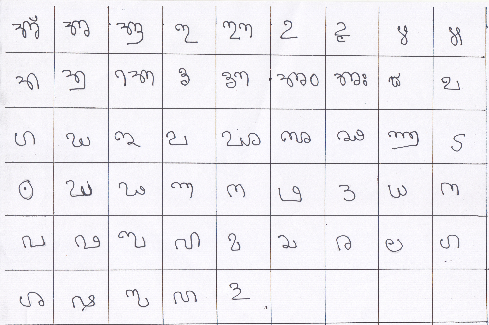
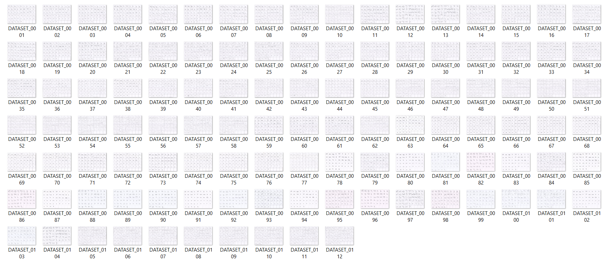
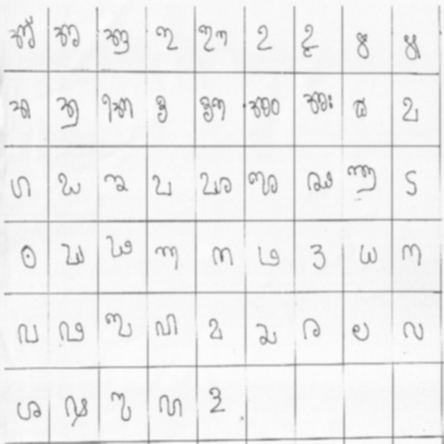
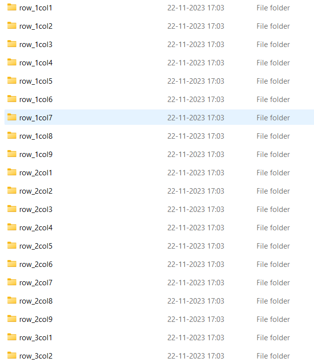
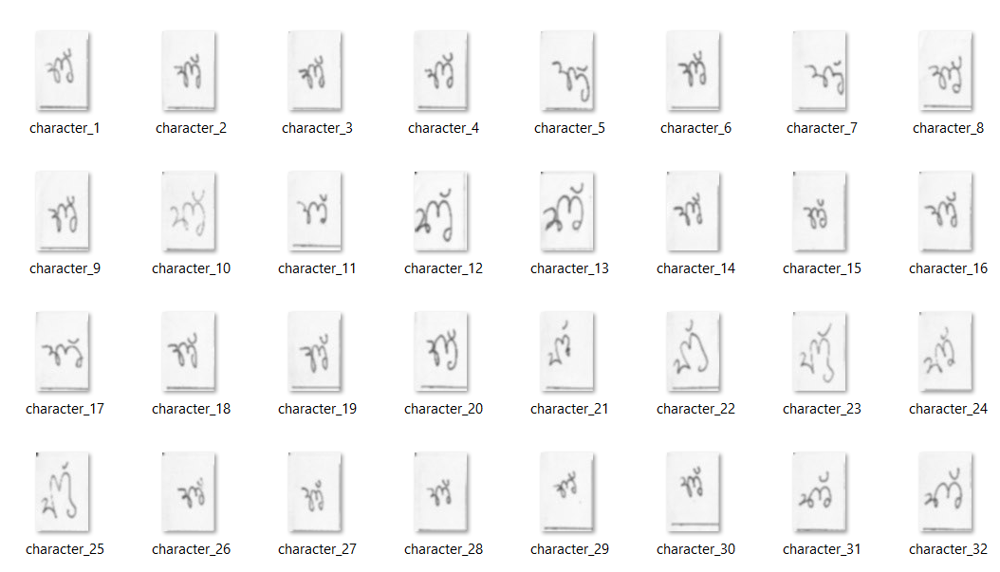

## _Tulu Manuscript OCR: Preserving Ancient Wisdom Through Character Recognition_
### Project Overview

*This project aims to address the scarcity of efficient OCR solutions for the Tulu language, which is spoken in coastal Karnataka. By using machine learning algorithms, we built an OCR system that can accurately recognize Tulu characters from manuscript images. The model was trained using a dataset of augmented Tulu characters and achieved an accuracy of 92.35% using the Random Forest algorithm.*

### Project Workflow

**1. Dataset Preparation**

_The dataset for this project consisted of A4 sheets containing handwritten Tulu characters arranged in a 6x9 table format. These sheets were scanned and saved as images, forming the base of our dataset. The total number of sheets was 112, each containing 54 characters. This provided a solid foundation for building our Tulu Manuscript OCR system._

_You can imagine the dataset as a collection of scanned pages, where each character was neatly written in individual cells of the table, which allowed for clear segmentation and character extraction._

### Image Example:

  
  

**2. Preprocessing**
_The scanned images were preprocessed to remove noise and prepare them for character extraction. This involved converting the images to grayscale and applying Gaussian blur._

### Image Example (Grayscale and Blurred Image):

  

**3. Character Extraction**
_Each scanned image, containing multiple characters in a 6x9 grid, was segmented into individual characters based on their positions in the table. This process ensured that each character was isolated and separated for further analysis. Since the Tulu language consists of 50 alphabets, all characters were carefully segmented from the table and stored in corresponding columns. This structured approach allowed for efficient organization and storage of the characters, making them easily accessible for the next stages of processing._

### Image Example (Extracted Characters):

  
  

**4. Binarization**
_Binarization was applied to the grayscale images, converting them into black-and-white format to enhance contrast and make the characters stand out more clearly._

### Image Example (Binarized Image):

**5. Resizing and Cropping**
_The extracted characters were resized to a uniform size of 100x100 pixels to ensure consistency across the dataset. Cropping was also performed to eliminate unnecessary borders around the characters._

### Image Example (Resized and Cropped Image):
